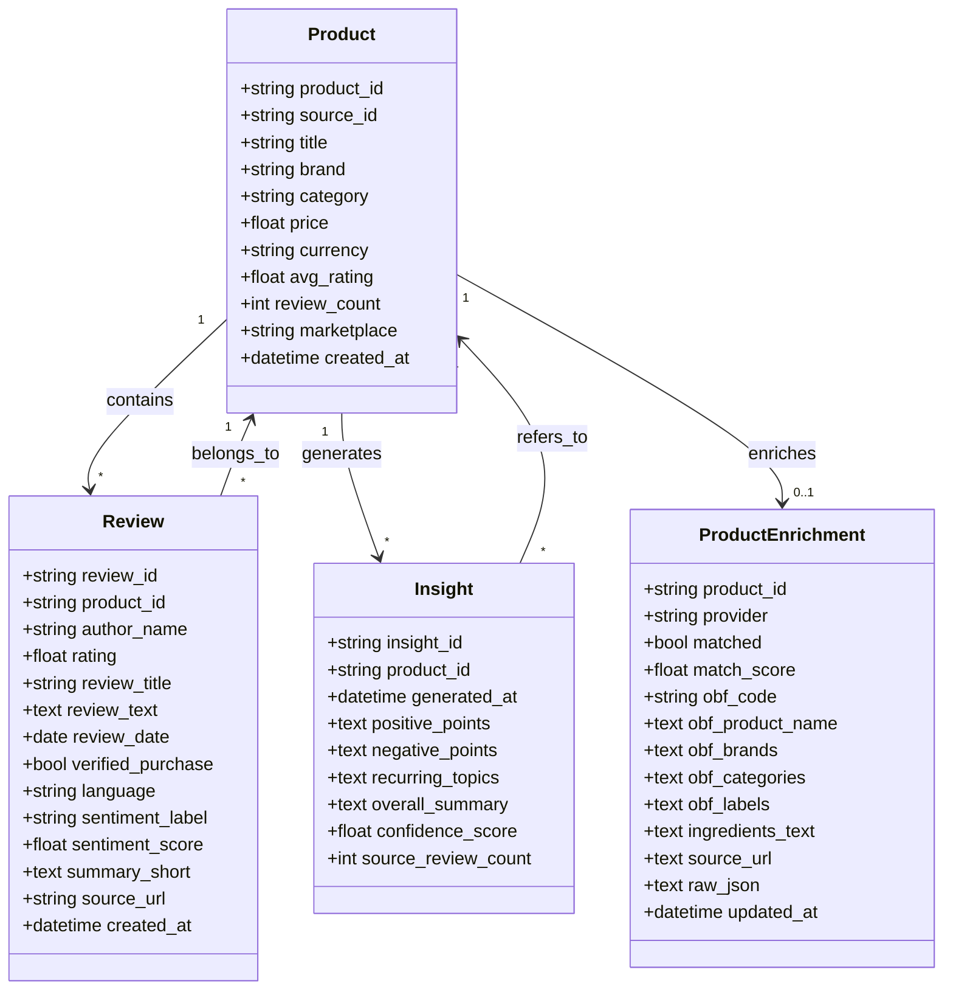
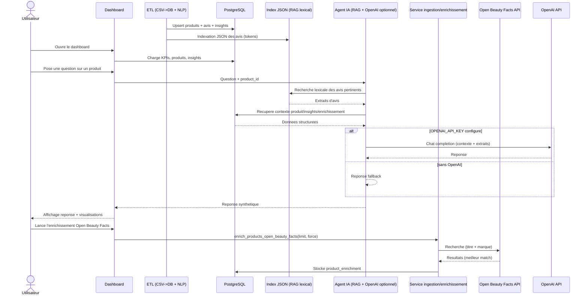

# AI Marketplace Assistant

Assistant IA capable d'analyser des produits et des avis clients pour generer des syntheses, detecter les points forts et faibles, et fournir des insights exploitables via un dashboard et un agent conversationnel base sur le RAG.

## Objectif

Ce projet vise a construire une architecture IA complete pour :

- ingerer des donnees produits et avis depuis des datasets publics (MVP) ;
- automatiser un pipeline ETL (CSV -> SQL) ;
- enrichir les avis avec des traitements NLP (sentiment, aspects, resume court) ;
- indexer les avis dans un index local JSON pour un RAG MVP (recherche lexicale) ;
- permettre a un agent IA de repondre a des questions metier a partir des avis + syntheses ;
- visualiser les resultats dans un dashboard orienté decision.

## Valeur metier

L'assistant permet de :

- reduire le temps passe a lire manuellement des centaines d'avis ;
- identifier rapidement les irritants clients et les qualites recurrentes ;
- comparer plusieurs produits ou categories ;
- alimenter des equipes e-commerce, marketing, produit ou customer success avec des insights actionnables ;
- demontrer une architecture IA concrete, automatisable et presentable en portfolio.

## Cas d'usage

- "Quels sont les points faibles de ce produit ?"
- "Resume les avis du produit X en 5 points."
- "Quels themes negatifs reviennent le plus dans la categorie audio ?"
- "Quels produits ont le meilleur rapport qualite/prix selon les avis ?"

## Sources de donnees

### Donnees utilisees actuellement

- avis cosmetique (Sephora) : `data/raw/sephora_skindataall.csv` (dataset public, format CSV)
- enrichissement produit optionnel : Open Beauty Facts (API publique, sans cle)

## Architecture globale

```mermaid
flowchart LR
A[CSV Sephora] --> B[ETL (Pandas + NLP)]
B --> C[(PostgreSQL)]
B --> D[(Index JSON RAG - recherche lexicale)]

C --> E[API FastAPI]
C --> F[Dashboard Streamlit]

D --> G[Agent IA (RAG + OpenAI optionnel)]
C --> G
G --> E
G --> F

E --> H[Service enrichissement (Open Beauty Facts)]
F --> H
H --> I[Open Beauty Facts API]
H --> C
```

Note : le RAG est un MVP base sur une recherche lexicale (tokens) et un index local JSON.

## Pipeline ETL

### 1. Extraction

Collecte des donnees (actuel) :

- fichier CSV (Sephora)
- API Open Beauty Facts (enrichissement produit)

### 2. Nettoyage

- suppression des doublons
- suppression des avis vides ou trop courts
- normalisation du texte
- nettoyage HTML et caracteres parasites
- uniformisation des dates, prix et notes
- detection de langue

### 3. Transformation

- calcul du sentiment
- extraction des mots-cles et aspects
- generation de resumes courts
- enrichissement avec metadonnees produit

### 4. Stockage

- base relationnelle : `PostgreSQL`
- index RAG MVP : `data/vectorstore/reviews_index.json` (JSON, recherche lexicale)

## Modele de donnees

### Table `products`

| Champ | Type | Exemple |
|---|---|---|
| `product_id` | UUID / VARCHAR | `157` |
| `source_id` | VARCHAR | *(optionnel)* |
| `title` | TEXT | `Superfood Antioxidant Cleanser` |
| `brand` | VARCHAR | `YOUTH TO THE PEOPLE` |
| `category` | VARCHAR | `Cleanser` |
| `price` | DECIMAL(10,2) | `39.0` |
| `currency` | VARCHAR(3) | `USD` |
| `avg_rating` | DECIMAL(2,1) | *(calcule via aggregation des avis)* |
| `review_count` | INT | *(calcule via aggregation des avis)* |
| `marketplace` | VARCHAR | `Sephora` |
| `created_at` | TIMESTAMP | `2026-05-19 10:00:00` |

### Table `reviews`

| Champ | Type | Exemple |
|---|---|---|
| `review_id` | UUID / VARCHAR | `REV_1001` |
| `product_id` | FK | `PRD_001` |
| `author_name` | VARCHAR | `Marie92` |
| `rating` | DECIMAL(2,1) | `2.0` |
| `review_title` | TEXT | `Bon son mais batterie faible` |
| `review_text` | TEXT | `Le son est bon, mais autonomie decevante.` |
| `review_date` | DATE | `2026-03-25` |
| `verified_purchase` | BOOLEAN | `true` |
| `language` | VARCHAR(5) | `fr` |
| `sentiment_label` | VARCHAR | `negative` |
| `sentiment_score` | DECIMAL(4,3) | `-0.712` |
| `summary_short` | TEXT | `Bon audio, autonomie faible.` |
| `source_url` | TEXT | `https://...` |
| `created_at` | TIMESTAMP | `2026-04-03 10:05:00` |

### Table `insights`

| Champ | Type | Exemple |
|---|---|---|
| `insight_id` | UUID / VARCHAR | `INS_001` |
| `product_id` | FK | `PRD_001` |
| `generated_at` | TIMESTAMP | `2026-04-03 11:00:00` |
| `positive_points` | JSON / TEXT | `["Qualite sonore", "Confort"]` |
| `negative_points` | JSON / TEXT | `["Batterie", "Bluetooth instable"]` |
| `recurring_topics` | JSON / TEXT | `["autonomie", "confort", "connexion"]` |
| `overall_summary` | TEXT | `Produit apprecie pour le son, critique pour l'autonomie.` |
| `confidence_score` | DECIMAL(4,3) | `0.89` |
| `source_review_count` | INT | `350` |

### Table `product_enrichment`

Enrichissement produit via Open Beauty Facts (si match).

| Champ | Type | Exemple |
|---|---|---|
| `product_id` | FK (PK) | `157` |
| `provider` | VARCHAR | `open_beauty_facts` |
| `matched` | BOOLEAN | `true` |
| `match_score` | FLOAT | `0.42` |
| `obf_product_name` | TEXT | `...` |
| `obf_labels` | TEXT | `Organic, Vegan` |
| `ingredients_text` | TEXT | `Aqua, ...` |
| `source_url` | TEXT | `https://world.openbeautyfacts.org/...` |

## Pretraitement et analyse IA

### Preparation NLP

- nettoyage de texte
- tokenization
- lemmatisation si necessaire
- detection de langue
- classification de sentiment
- extraction d'aspects : batterie, prix, livraison, qualite, confort

### Exemple d'avis

Avis brut :

> "Great cleanser but it dries my skin and irritates a bit."

Apres nettoyage :

> "great cleanser but it dries my skin and irritates a bit"

Enrichissement possible :

- sentiment : negatif ou neutral
- aspects : `hydration`, `irritation`
- resume : `Good cleanser but drying and irritating.`

## Index RAG

### Construction

1. tokenisation des avis (mots normalises)
2. sauvegarde dans un index local JSON par `review_id`
3. recherche lexicale par overlap de mots entre question et avis

### Exemple d'entree d'index

```json
{
  "review_id": "SEPH_157_3420_0",
  "product_id": "157",
  "review_text": "This is hands down the best cleanser ...",
  "rating": 5.0,
  "sentiment_label": "positive",
  "tokens": ["hands", "down", "best", "cleanser"]
}
```

### Ce que permet l'agent IA

- repondre a des questions comme : "Quels sont les points faibles ?"
- generer une synthese fiable a partir des avis reels
- expliquer ses reponses avec des extraits ou tendances issues des avis

## Dashboard

### Visualisations utiles

- distribution des notes
- repartition du sentiment
- top points forts
- top points faibles
- filtres par categorie, note, marque, marketplace

### Ecrans actuels (Streamlit)

- Dashboard : KPIs + sentiment global + catalogue + distribution des notes
- Produit : fiche produit + sentiment + avis recents + enrichissement (si disponible)
- Insights : analyses simples basees sur l'enrichissement (ingredients / labels) + taux negatif
- Chat IA : Q&A (OpenAI si `OPENAI_API_KEY` configure, sinon fallback)
- Enrichissement : lancement Open Beauty Facts + stats de couverture

## Diagramme de classes



## Diagramme de sequence



## Stack utilise

- ETL : Python, Pandas
- Base de donnees : PostgreSQL (Docker) via SQLAlchemy + pg8000
- NLP : heuristiques (sentiment / aspects / resume court)
- RAG MVP : index JSON + recherche lexicale
- Backend : FastAPI
- Dashboard : Streamlit + Plotly
- Enrichissement : Open Beauty Facts (API publique)
- LLM (optionnel) : OpenAI (si `OPENAI_API_KEY` configure)

## Lancement local

### 1. Installer les dependances

```bash
python -m venv venv
venv\Scripts\activate
pip install -r requirements.txt
```

### 2. Configurer l'environnement

Copier `.env.example` vers `.env` puis ajuster les chemins si besoin.

### 3. Charger des donnees (dataset actuel Sephora)

```bash
python -m src.scripts.run_etl data/raw/sephora_skindataall.csv
```

Note : le fichier `data/raw/sephora_skindataall.csv` n'est pas versionne dans GitHub. Place-le manuellement dans `data/raw/`.

### 4. Lancer l'API

```bash
uvicorn src.api.main:app --reload
```

### 5. Lancer le dashboard

```bash
streamlit run src/dashboard/app.py
```

### Endpoints utiles

- `GET /health`
- `GET /products`
- `GET /products/{product_id}/insight`
- `GET /products/{product_id}/ask?question=Quels sont les points faibles ?`
- `POST /admin/ingest?csv_path=data/raw/sephora_skindataall.csv`
- `POST /admin/enrich-openbeautyfacts?limit=50&force=false`

## Lancement avec Docker

### Prerequis

- Docker Desktop installe et demarre

### Build et demarrage

```bash
docker compose up --build
```

### Acces

- API FastAPI : `http://localhost:8000`
- Healthcheck : `http://localhost:8000/health`
- Dashboard Streamlit : `http://localhost:8502`
- pgAdmin : `http://localhost:8080`

### Arret

```bash
docker compose down
```

### Reinitialiser les donnees

```bash
docker compose down
```

Pour reinitialiser le volume PostgreSQL :

```bash
docker compose down -v
```

Pour reinitialiser l'index RAG (local) :

```bash
rm -f data/vectorstore/reviews_index.json
```

Le projet utilise :

- un volume Docker `pgdata` pour la base PostgreSQL
- un dossier local `./data` monte dans les conteneurs pour l'index local et les fichiers CSV

## Exemple d'insight attendu

Produit : `Superfood Antioxidant Cleanser`

- points forts : efficacite, douceur, peau plus nette
- points faibles : irritation, assèchement, parfum
- synthese : le produit est souvent apprecie pour son efficacite, mais des avis mentionnent des irritations et une sensation de peau seche.

## Pourquoi ce projet est fort pour un portfolio

Ce projet montre une maitrise complete d'une chaine IA moderne :

- ingestion de donnees reelles ou simulees
- architecture ETL
- analyse NLP appliquee
- moteur RAG
- agent conversationnel
- dashboard metier

Il relie clairement la technique a une valeur business mesurable, ce qui le rend tres pertinent pour un recruteur.
